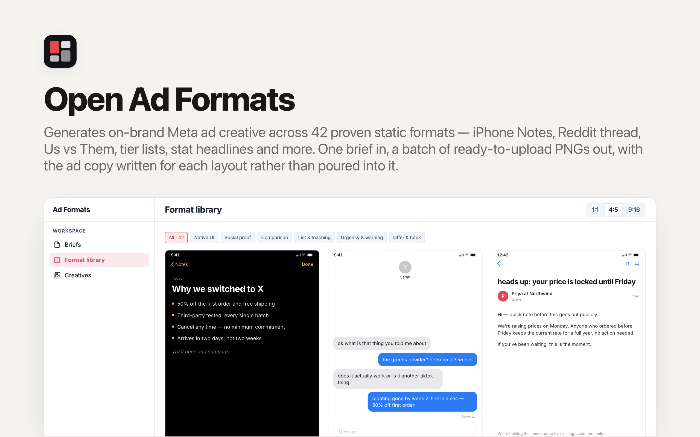

<p align="center">
  <picture>
    <source media="(prefers-color-scheme: dark)" srcset="./readme-banner-dark.png">
    
  </picture>
</p>

# OpenAdFormats

**The open-source ad-creative studio for Meta.** Describe your product once, pick from **42 proven static ad formats**, and get a batch of on-brand, ready-to-upload PNGs — with the copy written *for* each layout instead of poured into it.

Built with **React + Tailwind CSS**, a **Hono API** and a **SQLite database**. An open-source app template provided by [Clawnify](https://clawnify.com).

An open-source alternative to credit-based creative tools like AdCreative.ai — with three differences that matter:

- **Formats, not filters.** Every creative is a named archetype that performs — "iPhone Notes", "Reddit thread", "Us vs Them", "Tier list" — not a stock template with your logo dropped in.
- **The copy is written per layout.** Each format declares the exact fields it renders, so the model writes a five-message iMessage thread for the text-message format and a symptom checklist for the signs format. No generic headline stretched across forty designs.
- **It cannot invent claims.** Statistics, prices, deadlines and scarcity come from your brief or they don't appear. That's a hard rule in the generator, not a suggestion in a prompt.

## The format library

42 formats across six categories. Each carries a `use_when` line so you (or an agent) can pick on judgment rather than by scrolling thumbnails.

| Category | Formats |
|---|---|
| **Native UI** | iPhone Notes · Text Message · Email Screenshot · Reddit Thread · X Post · Search Results · Sticky Notes · Instagram Story · Question Sticker |
| **Social proof** | Trustpilot Review · Zero Stars · Customer Testimonial · UGC Caption |
| **Comparison** | Us vs Them · Us vs Us · New vs Old · Problem vs Solution · Myth vs Fact · Venn Diagram · Comparison to Winner · Before / After |
| **List & teaching** | X Reasons Why · X Signs You… · Tier List · The 101 · Crossed-Out Problems · Transformation Timeline · Diagram / Flowchart |
| **Urgency & warning** | Low Stock Alert · Warning Banner · Breaking News · In Case Of · Apology · Side Effect |
| **Offer & hook** | Don't Buy This · Don't Pay Full Price · Stop Doing This · Stat Headline · Static Big Type · Bundle Offer · Tear-Off Ticket · Objection Handler |

Every format renders at **1:1 (1080×1080)**, **4:5 (1080×1350)** or **9:16 (1080×1920)** — exported at 2× so a 4:5 creative lands as a 2160×2700 PNG.

## How it works

```
Brief (product, audience, promise, proof, objections, offer)
  └─ pick formats ──▶ per-format copy generation (OpenRouter)
                       └─ copy validated against that format's exact shape
                          └─ format.build() → self-contained HTML
                             └─ managed Chrome render → PNG @2x → object storage
```

Two ideas carry the whole design:

1. **A format owns its copy shape.** `FormatDef` declares the fields it renders, and the generator asks for exactly those. Validation happens before anything is drawn, so a malformed response is retried, never rendered.
2. **The brand kit is the visual system.** Colours and fonts flow into every template as CSS custom properties. The same format under two kits produces two visibly different, on-brand ads — no template carries a hardcoded hex.

## Quickstart

```bash
pnpm install
cp .dev.vars.example .dev.vars   # add OPENROUTER_API_KEY
pnpm dev                          # UI on :3000, API on :8787
```

Locally you get real copy generation and live HTML previews of every format. PNG rendering needs `CLAWNIFY_TOKEN`, which Clawnify injects automatically on deploy.

### Preview every format at once

```bash
CLAWNIFY_TOKEN=… npx tsx scripts/render-all.ts preview 4:5
```

Renders all 42 formats with their example copy into `preview/`. This is the visual-regression harness — run it after touching any format and look at the output before shipping.

## Adding a format

One entry in a category file under `src/server/formats/`, one line in `src/server/formats/index.ts`. The UI, the copy generator, the batch runner and the agent's API description all derive from that registry, so nothing else needs touching.

```ts
const myFormat: FormatDef<MyCopy> = {
  id: "my-format",
  name: "My Format",
  category: "offer",
  summary: "What the creative looks like.",
  useWhen: "When this format is the right pick.",
  sizes: ["1:1", "4:5"],
  example: { headline: "…", bullets: ["…"] },   // shape + gallery preview
  guidance: "Format-specific copy rules.",
  parse: shapeOf<MyCopy>({ headline: "", bullets: [""] }),
  build(ctx) { return shell(ctx, `…`); },
};
```

Never hardcode a colour or typeface in `build()` — read `var(--accent)`, `var(--ink)`, `var(--surface)` from the shell so the brand kit stays in charge.

## Claim safety

Ad accounts get restricted over invented claims, so the generator is built to make that hard:

- The system prompt forbids inventing statistics, prices, discounts, timeframes, customer counts, certifications and scarcity. The brief is the only source of substantiated fact.
- No medical, financial or income claims, and no promising a specific result.
- No naming a real competitor brand — formats describe the category instead.
- Formats that structurally need a real number (`stat-headline`, `low-stock-alert`, `warning`, `bundle-offer`) say so in their guidance and are documented as skippable when the brief lacks one.

None of this is a substitute for reading the creative before you run it.

## API

Clawnify generates `/api/openapi.json` and `/llms.txt` from the live routes. The endpoints an agent reaches for:

| Method | Path | Purpose |
|---|---|---|
| `GET` | `/api/v1/formats` | The catalogue with `use_when` — start here |
| `POST` | `/api/briefs` | Create a brief |
| `POST` | `/api/briefs/:id/photo` | Upload a product photo (multipart) |
| `POST` | `/api/v1/batches` | Generate a batch — **the only call that spends money** |
| `GET` | `/api/v1/batches/:id` | Creatives with urls, status and generated copy |
| `GET` | `/api/v1/batches/:id/export` | Download manifest for a media buyer |
| `GET` | `/api/preview/:format_id` | Live HTML preview — free, no model call |
| `GET` | `/api/creatives/:id/html` | Re-render a saved creative — free |

## Scope

This builds **static** creative and exports it. It does not upload ads to Meta — you download the PNGs and the copy manifest and take them to Ads Manager. Video formats (talking head, podcast clip, unboxing) and image-model formats (claymation, meme, text-on-skin) are deliberately out of scope for this version.

## License

MIT
